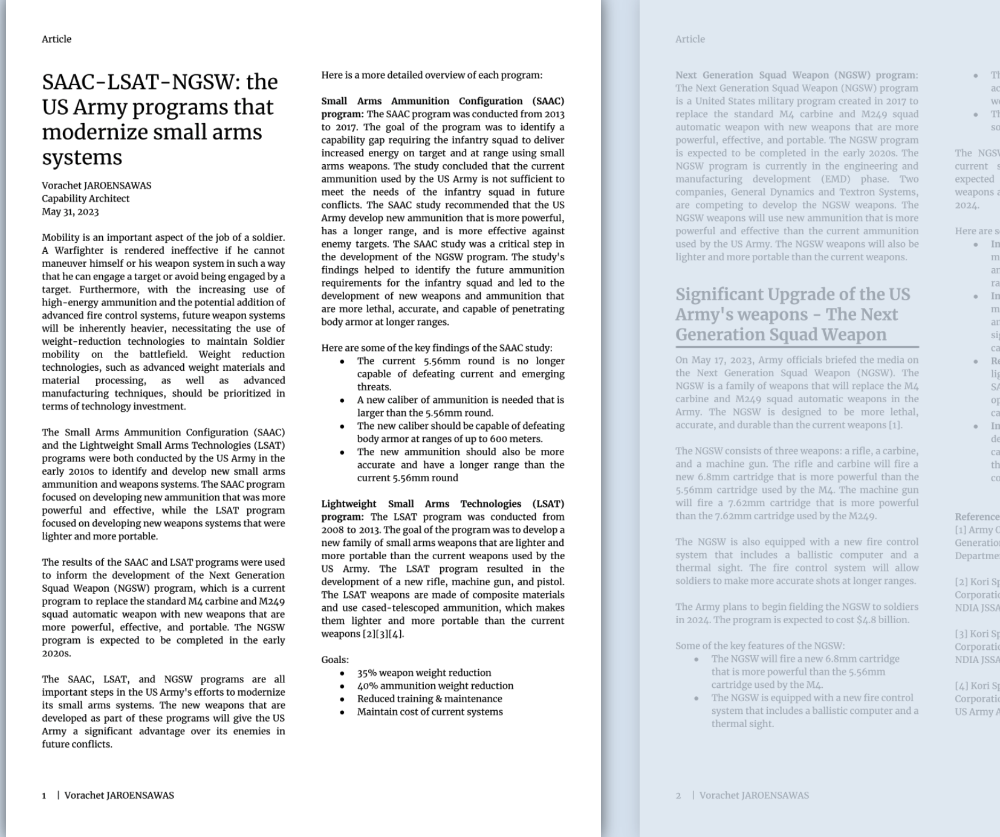
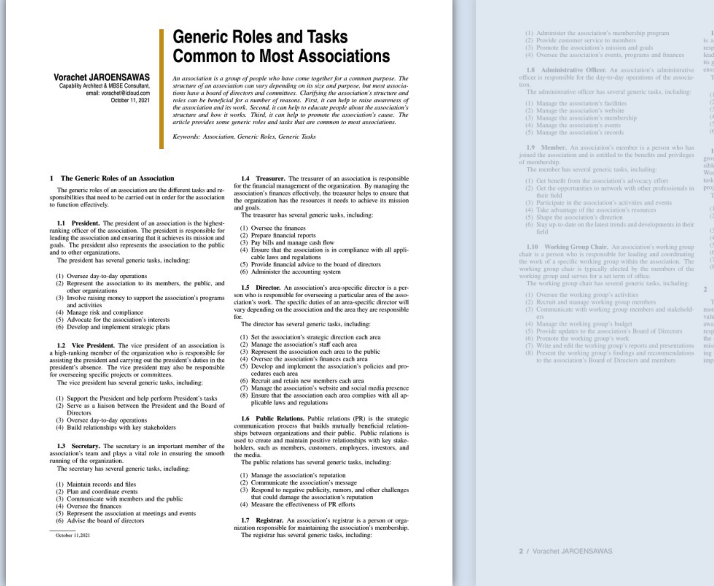

Vorachet's MBSE, defense, security articles

## SAAC-LSAT-NGSW: the US Army programs that modernize small arms systems

22 December, 2022

This article presents the US Army programs that modernize small arms systems.

## Generic Roles and Tasks Common to Most Associations
October 11, 2021

An association is a group of people who have come together for a common purpose. The structure of an association can vary depending on its size and purpose, but most associa- tions have a board of directors and committees. Clarifying the association’s structure and roles can be beneficial for a number of reasons. First, it can help to raise awareness of the association and its work. Second, it can help to educate people about the association’s structure and how it works. Third, it can help to promote the association’s cause. The article provides some generic roles and tasks that are common to most associations.

## Situational Awareness
Feb 17, 2021

This article presents a conceptual overview of situational awareness and a breakdown of its components, as well as examples of situational awareness systems. 

