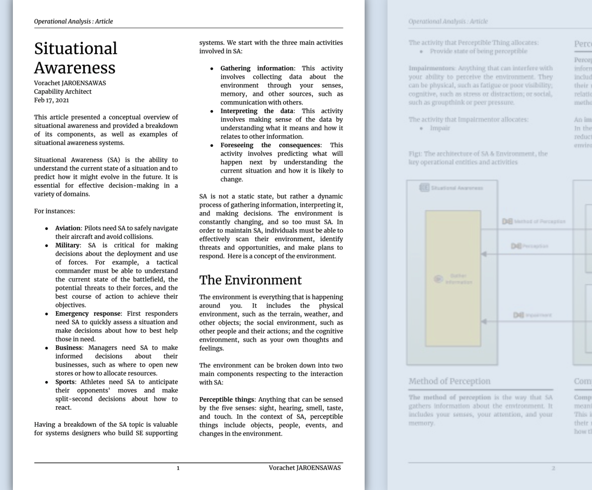

## เรือผิวน้ำไร้คนขับ Unmanned Surface Vessel

Junw 19, 2023  Thai language 

การก่อสร้างทางทะเล (Marine Construction) ​เป็นกระบวนการของการสร้าง ซ่อมแซม หรือบำรุงรักษาโครงสร้างในสภาพแวดล้อมทางทะเล ซึ่งรวมถึงกิจกรรมที่หลากหลาย เช่น การสร้างสะพาน ท่าเทียบเรือ และชานชาลานอกชายฝั่ง การขุดลอกร่องน้ำและท่าเรือ และติดตั้งท่อและสายเคเบิล การก่อสร้างทางทะเลเป็นงานที่ท้าทายและต้องใช้ความพยายามมาก เนื่องจากต้องทำงานในสภาพแวดล้อมที่ต้องรับมือกับอุปสรรคจากสภาพแวดล้อมธรรมชาติและสภาวะอากาศ  การก่อสร้างทางทะเลเป็นอุตสาหกรรมสำคัญที่มีบทบาทสำคัญต่อเศรษฐกิจโลก มีหน้าที่รับผิดชอบในการก่อสร้างสิ่งก่อสร้างมากมายที่เราพึ่งพากันอยู่ทุกวัน เช่น สะพาน ท่าเรือ และแท่นขุดเจาะน้ำมันนอกชายฝั่ง การก่อสร้างทางทะเลยังเป็นอุตสาหกรรมที่กำลังเติบโต เนื่องจากความต้องการโครงสร้างพื้นฐานใหม่ยังคงเพิ่มขึ้น  การก่อสร้างทางทะเลจำเป็นต้องจัดหาเครื่องมือในการวางแผน ดำเนินการ และจัดการโครงการก่อสร้างทางทะเล สามารถช่วยปรับปรุงประสิทธิภาพ ความปลอดภัย และความคุ้มค่าของโครงการ  ระบบสนับสนุนการก่อสร้างทางทะเล (Marine Construction Support System) คือชุดของเทคโนโลยีและกระบวนการที่ใช้เพื่อสนับสนุนการก่อสร้างโครงสร้างทางทะเล สามารถใช้เพื่อปรับปรุงประสิทธิภาพและความปลอดภัย ของโครงการก่อสร้างทางทะเล
ระบบสนับสนุนการก่อสร้างทางทะเลที่จะกล่าวถึงในบทความนี้คือ "เรือผิวน้ำไร้คนขับ" 

## Generic Roles and Tasks Common to Most Associations
October 11, 2021

The article provides some generic roles and tasks that are common to most associations.

## Situational Awareness
Feb 17, 2021

This article presents a conceptual overview of situational awareness and a breakdown of its components, as well as examples of situational awareness systems. 

